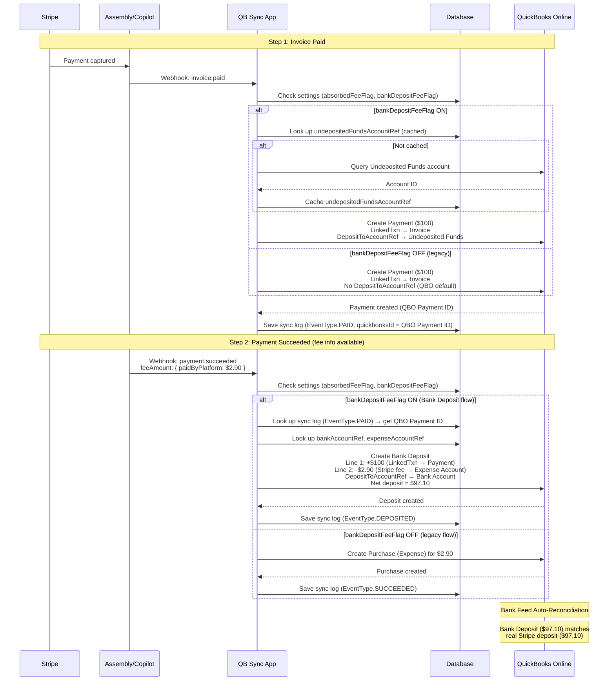
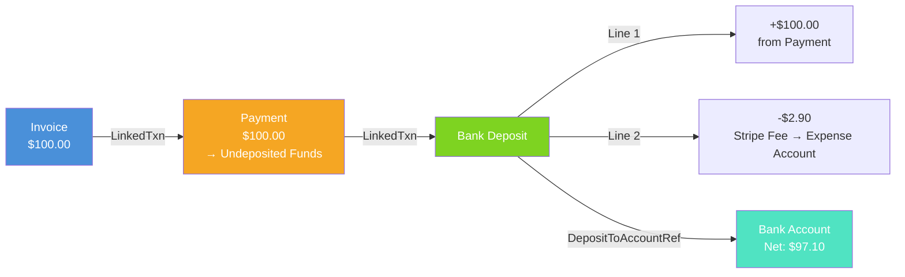
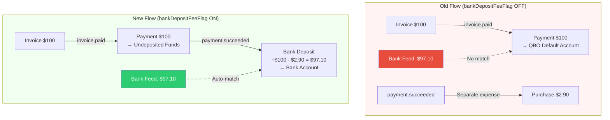

# Bank Deposit Flow (OUT-3604)

## Webhook-to-QBO Flow

```mermaid
sequenceDiagram
    participant Stripe
    participant Assembly as Assembly/Copilot
    participant App as QB Sync App
    participant DB as Database
    participant QBO as QuickBooks Online

    Note over Stripe,QBO: Step 1: Invoice Paid

    Stripe->>Assembly: Payment captured
    Assembly->>App: Webhook: invoice.paid
    App->>DB: Check settings (absorbedFeeFlag, bankDepositFeeFlag)

    alt bankDepositFeeFlag ON
        App->>DB: Look up undepositedFundsAccountRef (cached)
        alt Not cached
            App->>QBO: Query Undeposited Funds account
            QBO-->>App: Account ID
            App->>DB: Cache undepositedFundsAccountRef
        end
        App->>QBO: Create Payment ($100)<br/>LinkedTxn → Invoice<br/>DepositToAccountRef → Undeposited Funds
    else bankDepositFeeFlag OFF (legacy)
        App->>QBO: Create Payment ($100)<br/>LinkedTxn → Invoice<br/>No DepositToAccountRef (QBO default)
    end

    QBO-->>App: Payment created (QBO Payment ID)
    App->>DB: Save sync log (EventType.PAID, quickbooksId = QBO Payment ID)

    Note over Stripe,QBO: Step 2: Payment Succeeded (fee info available)

    Assembly->>App: Webhook: payment.succeeded<br/>feeAmount: { paidByPlatform: $2.90 }
    App->>DB: Check settings (absorbedFeeFlag, bankDepositFeeFlag)

    alt bankDepositFeeFlag ON (Bank Deposit flow)
        App->>DB: Look up sync log (EventType.PAID) → get QBO Payment ID
        App->>DB: Look up bankAccountRef, expenseAccountRef
        App->>QBO: Create Bank Deposit<br/>Line 1: +$100 (LinkedTxn → Payment)<br/>Line 2: -$2.90 (Stripe fee → Expense Account)<br/>DepositToAccountRef → Bank Account<br/>Net deposit = $97.10
        QBO-->>App: Deposit created
        App->>DB: Save sync log (EventType.DEPOSITED)
    else bankDepositFeeFlag OFF (legacy flow)
        App->>QBO: Create Purchase (Expense) for $2.90
        QBO-->>App: Purchase created
        App->>DB: Save sync log (EventType.SUCCEEDED)
    end

    Note over QBO: Bank Feed Auto-Reconciliation
    Note over QBO: Bank Deposit ($97.10) matches<br/>real Stripe deposit ($97.10)
```

## QBO Entity Relationships

```mermaid
graph LR
    INV[Invoice<br/>$100.00] -->|LinkedTxn| PAY[Payment<br/>$100.00<br/>→ Undeposited Funds]
    PAY -->|LinkedTxn| DEP[Bank Deposit]
    DEP -->|Line 1| GROSS[+$100.00<br/>from Payment]
    DEP -->|Line 2| FEE[-$2.90<br/>Stripe Fee → Expense Account]
    DEP -->|DepositToAccountRef| BANK[Bank Account<br/>Net: $97.10]

    style INV fill:#4a90d9,color:#fff
    style PAY fill:#f5a623,color:#fff
    style DEP fill:#7ed321,color:#fff
    style BANK fill:#50e3c2,color:#fff
```

## Old vs New Flow Comparison

```mermaid
graph TD
    subgraph OLD["Old Flow (bankDepositFeeFlag OFF)"]
        O_INV[Invoice $100] -->|invoice.paid| O_PAY[Payment $100<br/>→ QBO Default Account]
        O_STRIPE[Bank Feed: $97.10] -.->|No match| O_PAY
        O_FEE[payment.succeeded] -->|Separate expense| O_EXP[Purchase $2.90]
    end

    subgraph NEW["New Flow (bankDepositFeeFlag ON)"]
        N_INV[Invoice $100] -->|invoice.paid| N_PAY[Payment $100<br/>→ Undeposited Funds]
        N_PAY -->|payment.succeeded| N_DEP[Bank Deposit<br/>+$100 - $2.90 = $97.10<br/>→ Bank Account]
        N_STRIPE[Bank Feed: $97.10] -.->|Auto-match| N_DEP
    end

    style O_STRIPE fill:#e74c3c,color:#fff
    style N_STRIPE fill:#2ecc71,color:#fff
    style OLD fill:#fff3f3
    style NEW fill:#f0fff0
```
