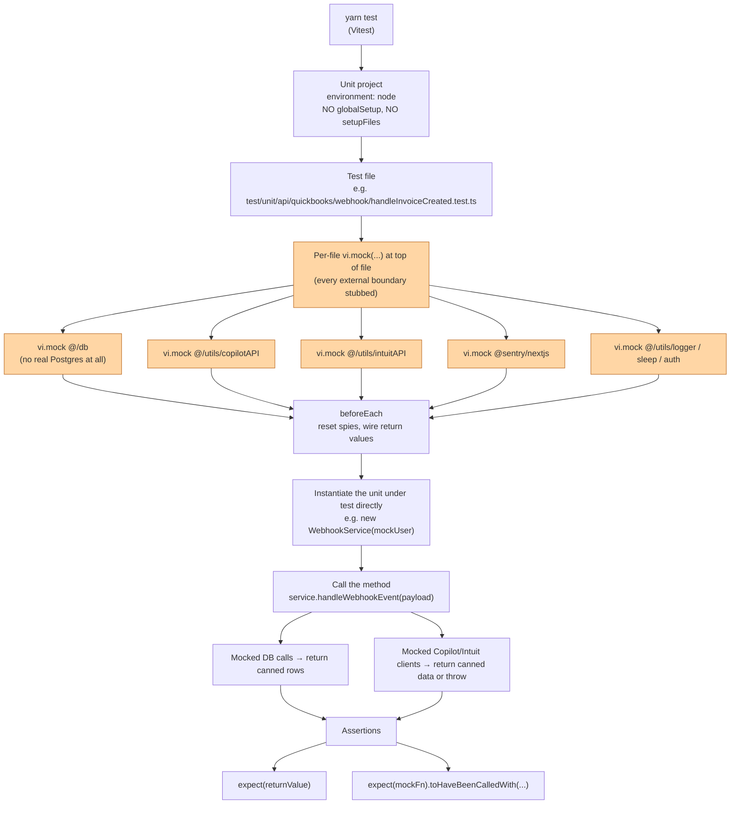
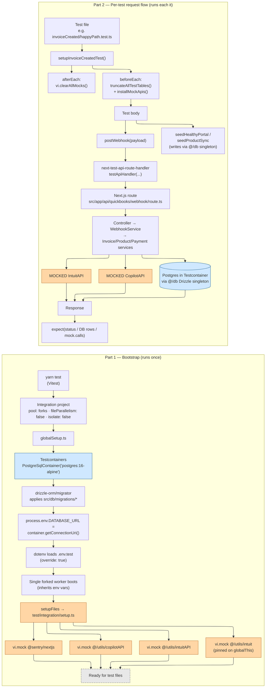

# Test execution flow

High-level diagrams of how unit and integration tests run in this repo. Aimed at a new engineer onboarding to the test suite.

Source of truth for the wiring shown here:
- `vitest.config.ts` (two projects: `unit`, `integration`)
- `test/integration/globalSetup.ts` (Testcontainers + migrations)
- `test/integration/setup.ts` (shared mocks for outbound APIs)
- `test/helpers/*` (`seed.ts`, `testDb.ts`, `webhook.ts`, `invoiceCreatedTestSetup.ts`, `mocks.ts`)

Legend used in every diagram:
- **Blue** = real infrastructure (Postgres in a container).
- **Orange** = mocked at the module boundary; no real network call leaves the process.

---

## Unit tests

No container, no migrations, no HTTP layer. Each test file owns its mocks at the top of the file and instantiates the unit under test directly.

Reading guide:
- Unit tests never reach `route.ts` or Drizzle.
- Each unit test file owns its mock declarations (this is the opposite of integration, where mocks are centralized in `setup.ts`).
- The unit-under-test is constructed directly with a fake `User` and called as a plain function; assertions are on its return value and on the recorded calls to the mocked dependencies.

---

## Integration tests

Two full vertical flows shown side by side. **Left column** runs once per `yarn test`; **right column** runs for each `it`. Read each column top-to-bottom independently. No edge connects the two — Part 1 simply leaves the worker in a state Part 2 can use.

Takeaways:
- **One container, one worker, one module registry** for the whole run. Outbound APIs (Copilot, Intuit, Sentry) are mocked once in Part 1 and every test file inherits those mocks.
- `pool: forks + fileParallelism: false + isolate: false` is what makes the shared module registry safe — see `docs/vitest-gotchas.md` for the traps that motivated those settings.
- The test hits the **real** Next.js route handler — middleware, Zod parsing, and `withErrorHandler` all execute. Only **outbound network** is faked; the database is real Postgres (blue).
- `truncateAllTestTables()` is what keeps a shared container safe across tests. If you add a new table to `src/db/schema/*`, add it to `test/helpers/testDb.ts` too.

---

## One-line summary

> Unit tests stub everything outside the function under test; integration tests stub only the **outbound** network (Copilot + Intuit + Sentry) and run the real route handler against a real Postgres started by Testcontainers.
